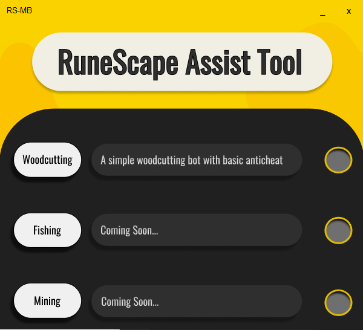

## Overview :crystal_ball:
A simple bot for RuneScape using YoloV5 object detection, image detection, and keyboard & mouse controls. 

## Installation :electric_plug:

```bash
pip install -r requirements.txt
```

## Startup :computer:

Once you have ran the RS-BT.exe file, or the main.py file, you should see a window as such:


From here, press the "Woodcutting" 
     
button to activate the woodcutting bot. A console should appear and output details about the bot.

## Usage :book:
    
Once activated, the bot should automatically tab into RuneScape, if open, or print a message in the console informing you that RuneScape is not open. To turn off the bot, simply hold the "=" key for a few seconds, or close the console.

(Note if you tab back into the main program screen, it may stop responding. However, the bot will continue to run normally as long as you do not terminate the program.)

## Anti Bot Detection :robot:
There are several measures in place to prevent bot detection, and the account used to test the bot has not been banned after ~1month of use, however there is still not a 100% guarantee that your Jagex account will not be banned.

### Measures :page_facing_up:
&nbsp;&nbsp;&nbsp;&nbsp;&nbsp;&nbsp;- There are random actions, such as moving the camera in game, that occur occasionally to simulate a human &nbsp;&nbsp;&nbsp;&nbsp;&nbsp;&nbsp;player.
 
&nbsp;&nbsp;&nbsp;&nbsp;&nbsp;&nbsp;- Every so often, the bot will print out a message to simulate a human   player.

&nbsp;&nbsp;&nbsp;&nbsp;&nbsp;&nbsp;- Nearly all delays are randomized and humanized.

&nbsp;&nbsp;&nbsp;&nbsp;&nbsp;&nbsp;- Mouse movement is humanized with the pyHM python library.

## Contributors :busts_in_silhouette:
Special thanks to [Kian Brose](https://www.youtube.com/channel/UC1AgWV7PLk_uVDkh35VVf9w) and [Ben Johnson](https://www.youtube.com/channel/UCD8vb6Bi7_K_78nItq5YITA) on youtube for botting tips and practices.

[Ravnit Lotay](https://github.com/Ravnit202)
